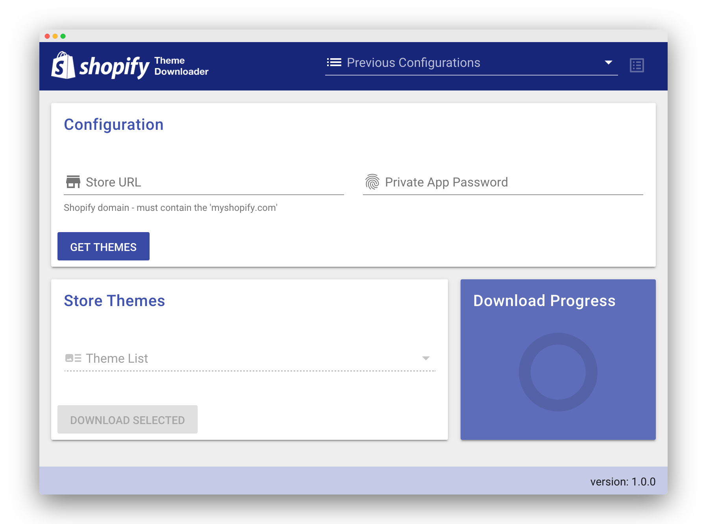

# shopify-theme-downloader
GUI for Shopify [Theme Kit](https://shopify.github.io/themekit/). Provides an easy way to connect to a Shopify store, choose and download themes.




## Features
- Connect to a Shopify store, get a list of themes and download a selected theme with ease via a clean interface.
- App saves automatically all previous store connections (Shopify Domain & Private app password) as a unique configuration making it easy to switch between stores.
- Manage previous saved configurations (store connections).
- Internal notifications and theme download progress.
- It works for MacOS, Windows and Linux

<br>

## How it works?
- App is based on Shopify [Theme Kit](https://shopify.github.io/themekit/), so it must be installed before using the app. Please read more at the [prerequisites](#prerequisites) section.

<br>

## <a href="#prerequisites"></a>Prerequisites
- Install the Shopify [Theme Kit](https://shopify.github.io/themekit/#installation).
- Setup a Shopify [private app](https://help.shopify.com/en/manual/apps/private-apps).

<br>

## Getting started
1. Make sure you read the [prerequisites](#prerequisites) section.
2. Download one of the distribution builds from the [releases page](https://github.com/hulk-apps/shopify-theme-downloader/releases) depending on your operating system and install the app.
3. Run the app.
4. Connect to a store by providing the store Shopify domain and the password from the private app.
5. If the connection is successful you can get a list of all provided store themes.
6. Download the theme of your choice.

<br>

## Download
Please visit the [releases page](https://github.com/hulk-apps/shopify-theme-downloader/releases). You can find precompiled binaries for MacOS, Windows and Linux.

<br>

## Important!
Please note that the pre-compiled installers aren't signed with any certificate during the build process so the installation packages will throw a security warning when you try to open the app. It is safe to ignore the warnings and proceed. However, it's up to you to extend the app and make your own builds according your needs. More about [code signing](https://www.electron.build/code-signing) for Electron builder.

<br>

## Development
App is made with the following frameworks and libraries:
- App is based on [Electron](https://electronjs.org/).
- [Vue.js](https://vuejs.org/).
- [Vuetify](https://vuetifyjs.com/en/).
- App is compatible with the Vue CLI if you are more familiar with that.

<br>

### Install all dependencies

If you use Yarn:

```yarn install```

or if you use NPM:

```npm run install```

<br>

### Run development version
If you use Yarn:

```yarn electron:serve```

or if you use NPM:

```npm run electron:serve```

<br>

### Build from the source
If you use Yarn:

```yarn electron:build```

or if you use NPM:

```npm run electron:build```

<br>

See the package.json for more available commands like generating app icons, linting and more.


